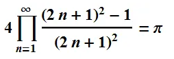
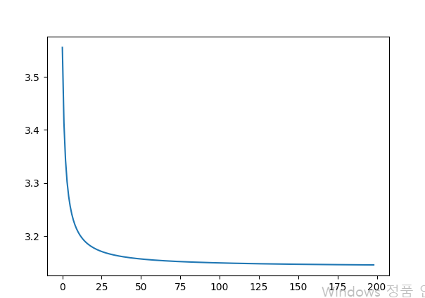

# 2025-1-파이썬 수업
이용희교수

목표: 
1. 머신러닝을 잘 하기위한 파이썬 프로그래밍
2. 객체지향개념을 연습하는 파이썬 프로그래밍
3. ADP, ADsP 실기시험을 위한 파이썬 프로그래밍
4. 코딩테스트 연습

## 깃허브와 파이참의 연동실험
파이참의 파일메뉴 -> 버젼관리에 있는 프로젝트 -> GitHub 선택
-> 원하는 리파지토리 선택 (2025-1pythonclass) -> 원하는 디렉토리 선택
-> **복제** 선택

## 변수와 자료형
 - 정수 int, 
 - 실수 float, 
 - 문자열 str, 
 - 논리형 bool
## 리스트
 한개의 변수에 여러값을 할당
- 인덱싱, 슬라이싱
- 리스트의 연산 - 덧셈, 곱셈, append, insert, remove

## 조건문
-if, else, elif

## 반복문
- for
- while

# 프로젝트1 : 파이값 구하기
파이값을 구하고 그래프로 그림
- 
```
p=1
pilist = []
for n in range(1,1000):
    p = p * ((2 * n + 1) ** 2 - 1) / (2 * n + 1) ** 2
    # print(p*4, ',')
    pilist.append(p*4)

import matplotlib.pyplot as plt
plt.plot(pilist)
plt.show()
```
- 